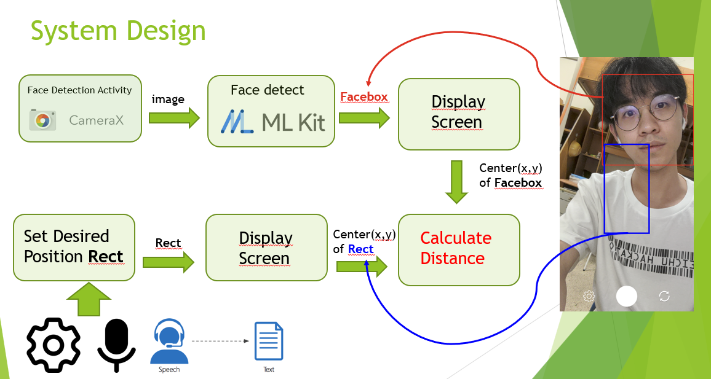
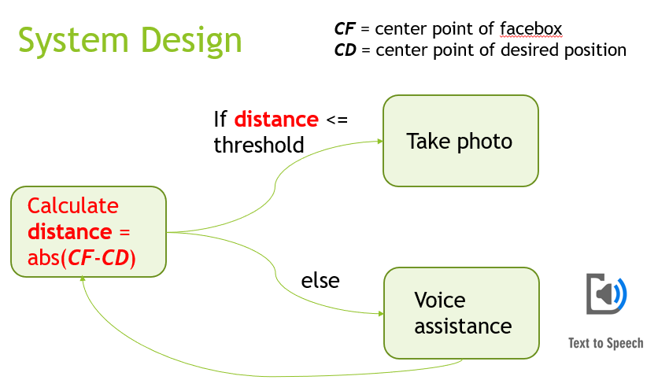

# Hackathon_2023
2023 Meichu Hackathon Google team
## Google Accessibility App - Help People Taking Selfie
### Target Users
* As a blind and visually impaired individual, I cannot see the screen clearly.
* As a regular user, I prefer using the back camera for taking selfies due to its better quality
-> Both of them have difficult taking a selfie from the desired angle or position.

### App Functions
* Capture the position of the user's face on the screen and provide voice feedback to guide them to the preferred position and angle.
* Users can adjust preferred position and angle settings through voice commands or manually setting.

### System Design

### Difference between Guided Frame
* Voice Control
* More customization: Allow users to set their preferred face position and face angle

